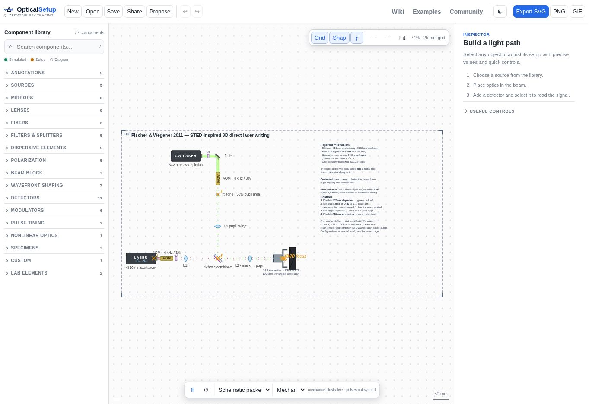

# Fischer & Wegener 2011 — original review

**Original PR #131, head `38b0f1ed897167808f90f8eb97ea774b1a553a55`.** Reviewed on 2026-09-13 from the clean, unchanged `fischer-2011` worktree. This assesses the original scene, not proposed integration improvements. **Browser coverage is incomplete:** desktop inspection and a phase-control experiment are complete; the approximately 1024 px check remains pending after the shared browser connection stalled.

## Primary evidence and provenance

Fischer and Wegener, *Three-dimensional direct laser writing inspired by stimulated-emission-depletion microscopy*, Optical Materials Express 1, 614–624 (2011), [DOI](https://doi.org/10.1364/OME.1.000614). Inspected the attached 11-page author manuscript `05-fischer-2011.pdf`, SHA-256 `55ded32ec38701a1bef2af6d67362338850bd658a953649ec4937fec1b8d49a8`; extracted its text and rendered and visually inspected manuscript pp. 6–7, including Fig. 2.

- **Reported, manuscript p. 6:** approximately 810 nm femtosecond excitation; circular polarization; Leica HCX PL APO objective, NA 1.4; circularly polarized 532 nm CW depletion; a 430 nm SU-8 cylinder with index 1.62 introducing a central π phase step. The mask is imaged onto the objective entrance pupil with its central zone occupying **about** half the pupil area. [Primary manuscript, p. 6](https://arxiv.org/pdf/1105.5703#page=6)
- **Reported, manuscript p. 7 and Fig. 2:** axial depletion lobes and a lateral ring; 0.25 wt% DETC/PETA resist; 100 µm/s scan speed; both beams AOM-chopped at 4 kHz and 3% duty. Depletion power is 50 mW for the shown structures; ordinary-DLW excitation optima span 7.4–8.3 mW, with STED-DLW optima 31% higher. Powers refer to the objective entrance pupil. Fig. 2 shows focal distributions, not an apparatus drawing. [Primary manuscript, p. 7](https://arxiv.org/pdf/1105.5703#page=7)
- **Design choices:** physical combining/folding train, lens prescriptions and spacings, beam diameter, objective EFL/WD/oil selection, scanner hardware and travel, 80 MHz/150 fs timing and the specific 10.48 mW excitation setting. The original evidence note identifies these correctly. The source's 50 mW setting is an on-state/pupil-power proxy, not a verified laser-head setting. Exact 810 nm, 50% and π inputs are nominal representations of the paper's approximate statements.

The original handoff appropriately transfers only 810 nm and NA 1.4 and disables transfer of its illustrative source power and timing.

## Actual train and geometric limits

The excitation traverses an AOM, quarter-wave plate and 100 mm lens. The depletion traverses a quarter-wave plate, fold, synchronized AOM, central phase plate and another 100 mm lens. A long-pass dichroic combines them; a shared 100 mm lens feeds the equivalent objective and resin stage, followed by a dump. The reported functional topology is plausible, while its mechanical prescription is inferred.

The phase-mask plane is 100 mm before its first lens; the folded lens separation is 200 mm; the final lens is 100 mm before the realized objective stop at **x = 500 mm**. The unfolded mask-to-stop matrix is `[-1, 0; 0, -1]`: a valid 1:1 image at that stop. However, the native objective's nominal BFP is **x = 505.13 mm**, its equivalent lens is x = 507.13 mm and its focus is x = 509.13 mm. Mask-to-BFP is `[-1, -5.13 mm; 0, -1]`. The original note explicitly identifies the clamped-stop proxy. This is a **mask-to-entrance-pupil** check, not a scanner-pivot relay, and must not be advertised as an exact BFP conjugacy.

The 5.6 mm mask aperture matches the modeled pupil; the central meridional diameter is `5.6 × sqrt(0.5)`, correctly distinguishing half the area from half the diameter. The phase plate adds optical path without bending rays. No simulated axial lobes, depletion ring, inhibition field or cured-volume reduction follows from it. The scene and inspector state this honestly. The high-NA focus is a geometric equivalent, and the writing marker is a pulsed arrival rather than a calculated voxel.

## Native verification

Ran `node --test test/fischer-2011.test.js`: **8/8 passed**, including scene round-trip persistence, finite geometry, source controls, phase-zone boundaries and restricted handoff. Independently exercised the original `parseSketch`, `traceScene`, `phasePlateIllumination`, objective helpers and `stageOffsetAt` without editing its files.

| Control | Observed original result |
| --- | --- |
| Default | Both wavelengths reach resin at `(509.13, 420)` mm; one representative excitation writing arrival carries the 4 kHz, 3% gate. All drawable coordinates are finite. |
| 532 nm off | Only the 810 nm sample signal remains; excitation writing arrival is unchanged. |
| 810 nm off, or power set to zero | 532 nm still reaches resin; zero writing arrivals. |
| Central area 0.5 → 0 | Sampled differential phase changes from 0.50 to 0 waves at 532 nm; both geometric sample hits remain unchanged. OPD = 0 also preserves those hits. |
| Stage static | Offset becomes `(0, 0)`; at 13.7 s the configured moving stage has local offset `(-1.13, 0)` mm. The inferred triangle sweep gives `2 × 5 mm × 0.01 Hz = 0.1 mm/s`. |
| Finite input bundle | Nine separate native line sources spanning the full 5.6 mm diameter, tested independently for each color, all reach `(509.13, 420)` with zero sampled focal span and finite paths. |

The last result verifies the nominal geometric train; it does not validate vectorial high-NA focusing or stimulated-depletion physics. The original default produces 1,591 drawables, largely from beam/gate rendering; no paper-specific wave-field solver is present.

## Browser evidence and outstanding checks

Opened the [exact original native editor](https://raw.githack.com/LucaGenchi/opticalsetup/38b0f1ed897167808f90f8eb97ea774b1a553a55/sketch/?paper=fischer-2011&edit=1) in the real browser at **1363 × 936**, with an 801 px canvas and 74% fitted zoom. Body width equaled viewport width; the toolbar, palette and inspector fit. The scene is framed but poorly uses the available space: a 1000 × 520 mm frame, large blank areas, dense 8 mm annotation text rendered around 6 px, and crowded BFP/WD/objective/resin labels. The pulsed excitation begins at the lower left, outside the collection's intended reading order. At 3% duty, the visible beam segments are sparse. These issues substantially limit an otherwise careful explanation.

Selected the native phase object, paused playback, and changed its area fraction **0.5 → 0 → 0.5** through the inspector: the readout returned **0.50 → 0.00 → 0.50 waves at 532 nm**. Its inspector limitation text is useful and readable. The label-based click timed out; a click on the visibly located mask selected it. Console inspection returned one browser-extension metadata error (`chrome-extension://…/content-script.bundle.js`) and **no app-origin warning/error in that inspected log**.

**Pending:** complete the approximately 1024 px native editor inspection, screenshot, controls and console check; recheck desktop console after the final browser interactions. The review fixture loaded its native editor shell, but subsequent calls failed with `CDP operation refresh tabs was superseded by browser recovery`. No 1024 screenshot or completed narrow-layout claim is supplied. The original files remain unchanged.

## Scores and recommendation

Scores assess the original. The last two measure burden, so these values must not be summed into a naive ranking. Visual clarity is based on the completed desktop inspection; narrow-layout acceptance remains open.

| Axis | Score / 5 | Reason |
| --- | ---: | --- |
| Source completeness | 4 | Strong primary mechanism/settings evidence; no full apparatus prescription. |
| Optical-train confidence | 3 | Coherent inferred train; explicitly clamped pupil proxy. |
| Distinctiveness | 5 | Two-color inhibition and a central π pupil step are a separate mechanism. |
| 2D compatibility | 2 | Routing and phase bookkeeping work; essential depletion/diffraction response is absent. |
| Educational value | 3 | Useful source/phase/model-boundary controls; no predicted inhibition outcome. |
| Visual clarity | 2 | Fits desktop but tiny prose and congested focus region impair comprehension. |
| Free interpretation required | 4 | Most mechanical prescription, timing and illustrated operating point are inferred. |
| Maintenance complexity | 2 | Uses mostly shared elements with a small reusable pupil-phase extension. |

**KEEP AFTER REWORK**, with final browser acceptance pending. Preserve this as a clearly bounded illustration of phase-pupil preparation and two-color delivery. Rework conditions: compact the frame and reduce canvas prose; place the pulsed source in the shared reading order; make the mask, its phase readout and objective/sample focus legible; retain the explicit stop/BFP distinction or choose a clearly labeled unclamped equivalent; preserve the no-depletion/no-PSF limitation and arrival-only marker semantics; complete both required browser widths. Do not invent a shrinking voxel or a depletion field to make the central control appear more effective.
