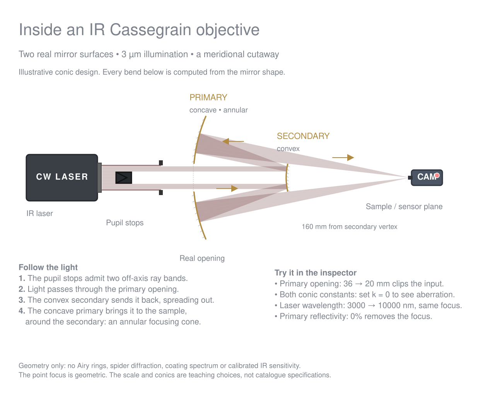

# IR Cassegrain objective verification

Open **Examples → Microscopy Implementations → IR Cassegrain objective — element by element**.
The companion page is generated from `tools/examples-content.mjs`; its sources,
analytic prescription and model limitations are kept there. Regenerate the native
scene with `node tools/build-cassegrain-example.mjs`.

The image is the app's `buildSVG({ whiteBg: true })` output rasterized to PNG,
not a browser screenshot or manually drawn ray diagram. It was visually inspected
for clipping, legibility, mirror geometry and the computed folded path.

## Deterministic results

| Experiment | Sensor relative ray signal | Geometric spot span |
| --- | ---: | ---: |
| Default, 3000 nm | 0.4802 | < 1e-8 mm |
| Primary opening 36 → 20 mm | 0.1600667 | < 1e-8 mm |
| Both conics changed to spheres (k = 0) | 0.4802 | 0.152062 mm |
| Wavelength 3000 → 10000 nm | 0.4802 | < 1e-8 mm |
| Primary reflectivity 98 → 49% | 0.2401 | < 1e-8 mm |
| Primary reflectivity 0% | No sensor arrivals | — |

These are 1D geometric ray weights, not area throughput or calibrated IR sensitivity.
The exact point focus follows this illustrative paraboloid/ellipsoid prescription;
it is not a diffraction-limited spot prediction or a commercial Schwarzschild model.

`test/conic-mirror.test.js` additionally checks rotated exact parabolic focusing,
central/exterior misses, hole-edge hits, a rejected hole root followed by an annular
hit on the same surface, opaque back faces, zero reflectivity, other conic families,
malformed input bounds, independent two-reflection routes, and save/reload equivalence.

Validation: `npm test` (801 passing), `git diff --check`, JavaScript syntax checks,
and the example manifest/page/sitemap generators.

## Browser check still required

Computer use was attempted. The browser rejected local preview navigation, and the
supported supervised preview could not start because its service mailbox was absent.
No interactive browser, console, desktop-width or 1024 px UI check is claimed.

For reviewer verification: serve the repo with `node serve.mjs`, load the example,
select each mirror and try the four controls above, save and reopen the JSON, and
inspect the palette, inspector, toolbar, labels and console at desktop and 1024 px.
The render remains a static visual check, not a substitute for that interactive gate.
