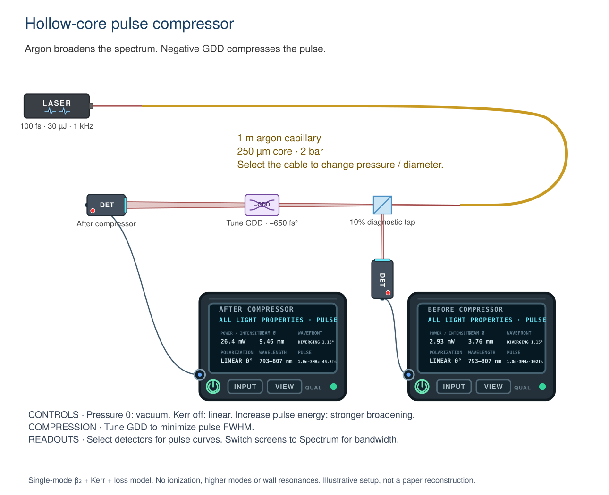

# Hollow-core pulse compression

Open **Examples → Ultrashort Pulses → Hollow-core pulse compressor**.
The native scene contains an enabled 800 nm Gaussian pulsed laser, an argon
capillary (the ordinary fiber tool with its model set to Hollow core · argon),
a 10% diagnostic tap, a signed-GDD compressor, two general detectors and their
linked screens. The tap measures the fiber output before compensation; the
other detector measures the compressed pulse. The layout is illustrative,
not a reconstruction of a specific experiment.

## Default and control experiments

The laser emits 100 fs pulses, 30 µJ each, at 1 kHz (30 mW average power).
The capillary is 1 m long, with a 250 µm core, 2 bar argon at a fixed 20 °C,
and a chosen 0.1 dB/m power loss. The Gaussian mode-area approximation is
`Aeff = π (0.64 a)²`, where `a` is the core radius. Geometrical ray capture is
assumed to couple perfectly into this mode; this is not a mode-overlap calculation.

| Control | Expected result |
| --- | --- |
| Default: compressor −650 fs² | About 102.3 fs at the capillary exit and 45.3 fs after compensation. Spectrum broadens in the capillary and is unchanged by the compressor. |
| Compressor GDD = 0 | Both detectors report the same pulse duration. |
| Kerr nonlinearity off | Nonlinear phase becomes zero. The spectrum stays at the input bandwidth while linear dispersion still acts. Retune the compressor; the original setting overcompensates this control. |
| Pressure = 0 | Gas dispersion and Kerr response vanish. Negative waveguide dispersion remains; hollow core is not β₂ = 0. |
| Double laser average power at fixed repetition rate | Pulse energy doubles, increasing nonlinear phase and spectral broadening; the previous compressor setting need not remain optimal. |
| Increase core diameter | Both waveguide dispersion magnitude and Kerr coefficient decrease approximately as inverse radius squared. |
| Laser power = 0 | No modeled light exits the capillary. |

Select the cable to inspect captured energy, calculated β₂, accumulated
nonlinear phase, spectrum RMS width and the output temporal intensity curve.
Select either detector for its current temporal curve and computed intensity
FWHM, including additional downstream GDD. The general-detector screens show
the arriving duration; their Spectrum view shows the propagated spectrum.
FWHM spans the outermost half-maximum crossings if the pulse has several peaks;
it should not be interpreted as the duration of one clean isolated pulse.

## Physics and assumptions

`sketch/js/pulse-field.js` implements a scalar symmetric split-step Fourier
solution with second-order dispersion, instantaneous Kerr phase and distributed
power loss. It propagates a complex field, not just a bandwidth or chirp scalar:

- Linear frequency-domain step: `Ã ← Ã exp(i β₂ Ω² Δz / 2)`.
- Nonlinear time-domain step: `A ← A exp(i γ |A|² Δz)`.
- Power attenuation: `P(z) = P(0) exp(−α z)`, with `α = ln(10) lossDbPerM / 10`.
- `γ = (2π/λ) n₂ / Aeff`. Argon n₂ is approximated as `1.01e−23 m²/W`
  at one atmosphere, proportional to pressure.

The FFT forward convention is `exp(−i Ωt)` and the carrier convention is
`E = A exp(−i ω₀t)`. Thus physical frequency is `ω₀ − Ω`. Spectrum export
includes the frequency-to-wavelength density Jacobian, and uses the existing
sampled-spectrum abstraction so ordinary spectrometers see the actual shape.
The compressor applies additional quadratic spectral phase to this field;
it cannot reset the pulse to the source's transform-limited width.

Argon refractivity uses Peck–Fisher, density-scaled from standard conditions to
20 °C. Analytic wavelength derivatives supply gas GVD and group index. The
smooth fundamental-mode capillary approximation adds
`β₂,wg = −u₁₁² λ³ / (8π³ c² a²)`, with `u₁₁ = 2.4048255577`.
At 800 nm, 250 µm diameter and 2 bar the components are approximately
+36.87 fs²/m from argon and −8.50 fs²/m from guidance, totaling +28.37 fs²/m.
Loss is user-specified rather than derived from the walls or bends.

Only one intact Gaussian transform-limited source train, optionally with
upstream GDD and wavelength-independent attenuation, can initialize this
model. Captured ray powers are summed before deriving energy; changing between
a line and a sized beam cannot change nonlinear strength when capture is equal.
Overlapping independent sources, pre-filtered spectra, and a second nonlinear
fiber acting on an already sampled envelope are rejected explicitly. Filtering
or wavelength conversion after the fiber invalidates temporal-field readouts;
the ray/spectral calculation still continues where supported.

The model excludes higher-order dispersion, wall resonances, multiple spatial
modes, self-steepening, ionization/plasma, Raman response, nonlinear coupling
between sources, coupling optics outside the capillary and pressure gradients.
It is not an anti-resonant-fiber design solver, supercontinuum/UV source model,
or a calibrated compressor prescription. Gaussian autocorrelation
approximations and generic beam-probe durations are suppressed for sampled
fields rather than reporting an invented Gaussian pulse.

## Numerical limits and validation

The default grid has 1024 time samples and a 24-input-duration window, expanded
for linear stretching. Propagation uses at least 32 steps, increasing to keep
the estimated nonlinear phase increment below about 1/32 rad. An LRU cache
avoids solving again on unchanged animation frames.

Supported input durations are 15–500 fs, center wavelengths 500–1800 nm and
lengths up to 10 m. The solver declines estimated nonlinear phase above 12 rad,
linear stretch above 6×, spectra touching grid boundaries or leaving the
argon-fit range, excessive fractional bandwidth, and significant temporal
energy at the window edges. The tracer also declines peak intensities above
5×10¹³ W/cm². These are **model validity limits, not laboratory safety or
ionization thresholds**. An unavailable fiber result is shown in its inspector
and emits no modeled output; this does not mean the physical fiber blocks light.
Extreme downstream GDD that exceeds the time window makes duration unavailable.

`test/hollow-core.test.js` checks FFT inversion/Parseval conservation, analytic
Gaussian broadening, dB energy loss, the analytic pure-SPM RMS bandwidth law,
1024/2048-sample and 64/128-step convergence, captured-power invariance,
polarizer attenuation, the native example's two measurement paths, local
packet duration after compression, save/reload, controls, inspector commits,
invalid spectral states and a 36-case pressure/core/energy sweep. Ordinary
fiber regression tests remain in `test/fiber-dispersion.test.js`.

Browser QA was attempted but blocked by unavailable preview infrastructure in
the implementation session. The image above is the actual native SVG export
rasterized and inspected for layout; it is not evidence of browser interaction.
Still to check in a browser at desktop and near 1024 px: selecting the cable,
changing model/pressure/diameter/Kerr settings, adjusting the laser and
compressor, opening both detector curves, switching screens to Spectrum,
save/reload, console errors and inspector overflow.

## Sources

- [Peck and Fisher, Dispersion of argon (1964)](https://doi.org/10.1364/JOSA.54.001362),
  refractivity formula [transcribed in the optical-constants database](https://refractiveindex.info/?shelf=main&book=Ar&page=Peck-0C).
- [Zahedpour, Wahlstrand and Milchberg (2015), Table 1](https://arxiv.org/pdf/1509.02232):
  argon Kerr coefficient and its weak near-infrared dispersion.
- [Grigorova et al., Dispersion-tuning of nonlinear optical pulse dynamics in gas-filled hollow capillary fibers](https://arxiv.org/html/2302.01113v2),
  Eq. 1: gas and waveguide dispersion contributions; experiments illustrate
  nonlinear processes beyond the bounded model implemented here.
