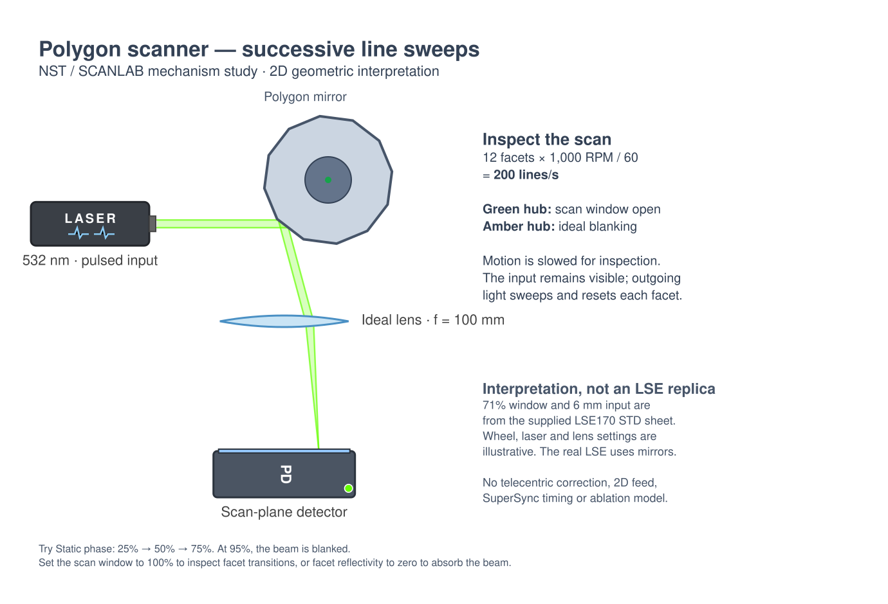
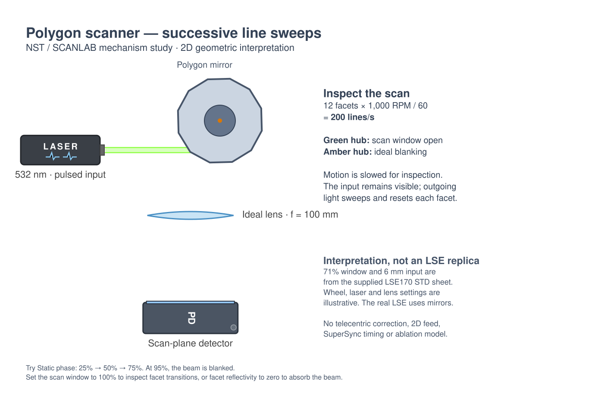

# Polygon scanner and line-scanning example

Find **Polygon scanner** in the Mirrors palette (search also accepts polygon
mirror, line scanner, NST, or SCANLAB). Open **Examples → Scanning → Polygon
scanner - line scanning** for a native, editable scene. The palette's Demo
action also supplies a compact scanner/lens/screen arrangement.

## Source and scope

Source: user-supplied **Polygon Scanner Systems**, Next Scan Technology / SCANLAB,
January 2018, `Polygon Scanner Systems_NST-SCANLAB_0.pdf`, two pages. Both pages
were rendered and inspected. Specifications below describe that supplied edition,
not a claim about current products.

| Evidence | Location | Treatment here |
| --- | --- | --- |
| Rotating polygon makes fast scan lines; an external perpendicular feed axis extends processing to an area | p. 1, diagram and High Throughput Raster Processing | Actual rotating-facet ray tracing; this 2D section shows one scan line. Perpendicular feed is out of plane and is not simulated. |
| LSE uses integrated telecentric mirrors | p. 2, Full Telecentric Optics | Not reconstructed: no mirror prescriptions are supplied. The example uses an explicitly illustrative thin lens. |
| LSE170 STD: 100–400 lines/s, 71% duty, 6 mm input beam (1/e²), 10 mm clear input aperture, 170 mm scan width | p. 2, specifications table | 200 lines/s and a 71% ideal blanking window; a 6 mm geometric beam. The beam uses native uniform ray sampling, not a Gaussian 1/e² profile. The 170 mm field and 10 mm head aperture are not imposed. |
| LSE170 HNA: 100–400 lines/s, 8 mm beam, 170 mm scan width; LSE300 STD: 56–224 lines/s, 11 mm beam, 300 mm scan width | p. 2, specifications table | Reference only; no product presets that imply matching a complete scan head. |
| 25–100 m/s moving spot speed; system efficiency >85% green/IR and >70% UV | p. 2, specifications table | Not claimed for this layout. Individual facet reflectivity is distinct from whole-head efficiency. |
| LSE170 STD minimum green spot diameter 22 µm under the sheet's conditions | p. 2, spot table and footnote 1 | Not calculated: an ideal ray crossing is not a diffraction-limited spot size prediction. |
| TrueRaster uses correction actuators; repeatability claims require SuperSync, and accuracy requires specified calibration | pp. 1–2, diagram, text, footnotes 2–3 | Not modeled. No timing-jitter, calibration, or proprietary correction claims. |

**Free interpretation — not specified in the datasheet:** 12 facets, 1,000 RPM,
100 mm wheel diameter, 98% facet reflectivity, wheel orientation, all bench
positions, a 100 mm focal-length / 100 mm diameter ideal lens, detector dimensions,
and the 532 nm / 300 fs / 1 MHz / 1 W illustrative source. The wavelength falls
within the sheet's green band. The source's pulse bandwidth is transform limited.
Pulse dynamics are hidden initially so the geometric sweep remains readable.

## What is computed

The component is a regular polygon centered on its rotation axis. Its drawn
edges and traced mirror segments come from the same vertices. Each facet reflects
the incident ray by the specular law. A small mechanical facet-angle change
therefore changes outgoing direction by twice that angle. Finite facets naturally
clip or redirect parts of a wide incident beam near a transition.

Facet rate is `facets × RPM / 60`. Phase is a percentage of one facet period;
50% places a left-facing facet at its central orientation before the element's
overall rotation. At the example's 315° orientation the incident beam turns
downward. Aim at the perimeter; the element's placement anchor is the hub.

The centered usable scan window is an **ideal synchronized blanker**. Outside
it, incident rays terminate at the wheel and its hub turns amber. Inside it,
the hub is green. This is a functional exposure-window illustration, not a model
of how the commercial laser/controller implements blanking. Coating loss is
absorbed by the opaque wheel, with no transmitted internal ghost rays.

Static mode freezes the selected phase. Zero RPM also stops motion. Facet counts
round to integers and geometry, rate, phase, duty, and reflectivity are bounded;
malformed/non-finite inputs fall back safely. Saved sketches remain version 1.

Animation uses the existing shared simulation clock where the sweep is watchable;
otherwise it shows one facet every 12 display seconds, as in Mechanics mode.
Animated exports follow the same rule. Slowed preview timing cannot establish
physical pulse-to-position synchronization. The lens uses the app's existing
paraxial model and is neither an f-theta nor a telecentric scan lens.

## Controls to try

1. Select Static phase and set phase to 25%, 50%, then 75%. The focus crosses
   the detector monotonically, moving roughly 26 mm each side of center.
2. Set phase to 95% with a 71% window. The input reaches the amber wheel,
   but no outgoing ray or detector signal remains. Set the window to 100%
   to inspect the facet transition, including finite-facet clipping.
3. Set facet reflectivity from 100% to 50% at the central phase. The collected
   signal halves without a spurious transmitted beam. At 0%, the wheel absorbs.
4. In Continuous rotation, change RPM from 1,000 to 2,000: the rate readout changes
   from 200 to 400 lines/s. Set RPM to zero to stop. Mechanics playback deliberately
   normalizes the visible cycle length; use the readout for the physical rate.

The Photodetector reports normalized ray signal. Source power is a separate
native power-attribution quantity; setting source power to zero does not disable
the geometric ray display in the current app. No material removal, curing,
diffraction spot, bitmap exposure pattern, perpendicular raster feed, or calibrated
throughput is inferred from this example.

## Verification

- Deterministic tests cover rate/phase, stationary rotation, closed facets,
  blanking, unsafe inputs, twice-angle reflection, moving detector focus,
  opaque losses, reflectivity, save/reload, and exported animation.
- Full regression suite: `npm test` (797 tests at implementation).
- `node tools/build-examples.mjs`, syntax checks for every `sketch/js/*.js`
  and `serve.mjs`, and `git diff --check`.
- Native SVG exports at central, off-center, and blanked phases were rendered
  for visual inspection. These are exports from the actual scene, not screenshots.
- Desktop / 1024 px browser interaction and console checks could not run:
  the supervised browser preview service was unavailable in this environment.
  Reproduce with `node serve.mjs`, open `/sketch/`, load the example, and check
  palette search, inspector edits, motion/pause/reset, Save/Open, and responsive
  layout at both widths.

